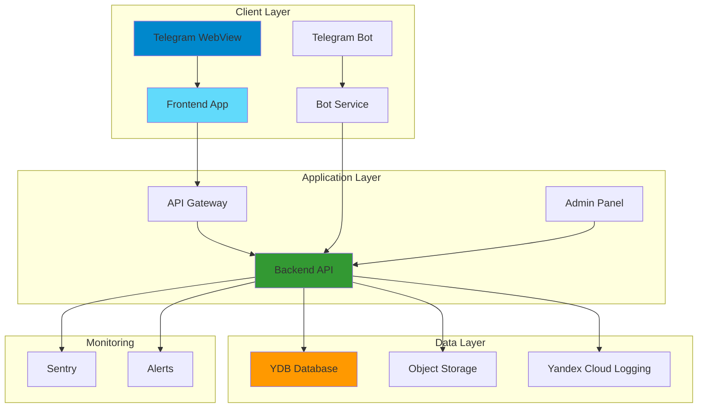

# Telegram Dating App

Dating приложение для Telegram с независимой архитектурой frontend и backend.

> ⚠️ **Для пользователей из России:** Sentry недоступен. Проект использует **Yandex AppMetrica** и **Catcher** (работают без VPN, можно оплатить русской картой). См. [docs/MONITORING_RU.md](docs/MONITORING_RU.md)

## 📋 О проекте

### Описание

Telegram Dating App - это современное приложение для знакомств, работающее внутри Telegram WebView. Пользователи могут создавать профили, участвовать в событиях, лайкать друг друга и находить матчи на основе общих интересов.

### Технологический стек

**Frontend:**

- React 18 + TypeScript
- Vite для сборки
- React Router v6 для роутинга
- TanStack Query (React Query) для кеширования
- CSS Modules для стилей
- Sentry для мониторинга ошибок

**Backend:**

- Node.js + Express + TypeScript
- Yandex Managed Service for YDB (база данных)
- Yandex Object Storage (файлы)
- Sharp для оптимизации изображений
- Pino для логирования
- Sentry для мониторинга

**Bot:**

- Telegraf для Telegram Bot API

**Admin:**

- React 18 + TypeScript
- Recharts для графиков
- TanStack Query для данных

**Infrastructure:**

- Yandex Cloud Functions (serverless)
- Yandex CDN для статики
- Docker для локальной разработки

### Архитектура



Подробнее: [docs/ARCHITECTURE.md](docs/ARCHITECTURE.md)

## 🚀 Quick Start

### Установка зависимостей

```bash
# Клонировать репозиторий
git clone <repository-url>
cd lug

# Установить все зависимости
npm install
```

### Настройка .env

```bash
# Скопировать пример конфигурации
cp .env.example .env

# Заполнить необходимые переменные
# Минимальный набор для запуска:
NODE_ENV=development
TELEGRAM_BOT_TOKEN_DEV=your-dev-bot-token
```

Полный список переменных: [docs/ENVIRONMENTS.md](docs/ENVIRONMENTS.md)

### Запуск локально (одна команда)

```bash
# Запустить все сервисы одновременно
NODE_ENV=development npm run dev:all
```

Это запустит:

- Frontend на `http://localhost:3000`
- Backend на `http://localhost:4000`
- Bot (если настроен)
- Admin на `http://localhost:5174`

### Первый запуск

1. **Установить зависимости**: `npm install`
2. **Настроить .env**: скопировать `.env.example` и заполнить
3. **Запустить seed данных** (опционально):
   ```bash
   npm run seed:dev
   ```
4. **Запустить приложение**: `NODE_ENV=development npm run dev:all`

## 📁 Структура проекта

```
lug/
├── frontend/              # Telegram Web App
│   ├── src/
│   │   ├── components/    # React компоненты
│   │   ├── pages/         # Страницы приложения
│   │   ├── design-system/ # Компоненты из Figma
│   │   ├── lib/           # Утилиты и конфигурация
│   │   └── utils/         # Вспомогательные функции
│   └── package.json
│
├── backend/               # API сервер
│   ├── src/
│   │   ├── routes/        # API endpoints
│   │   ├── middleware/    # Express middleware
│   │   ├── utils/         # Утилиты (оптимизация изображений)
│   │   └── config.ts      # Конфигурация
│   └── package.json
│
├── bot/                   # Telegram бот
│   ├── src/
│   │   └── index.ts       # Точка входа бота
│   └── package.json
│
├── admin/                 # Админ-панель
│   ├── src/
│   │   ├── components/    # Компоненты дашборда
│   │   └── pages/         # Страницы админки
│   └── package.json
│
├── shared/                # Общие типы TypeScript
│   ├── src/
│   │   └── index.ts       # Shared типы
│   └── package.json
│
├── scripts/               # Утилиты и скрипты
│   ├── seed.ts            # Генерация тестовых данных
│   ├── import-figma.ts    # Импорт из Figma
│   └── sync-figma.ts      # Синхронизация с Figma
│
├── docs/                  # Документация
│   ├── API.md             # API документация
│   ├── ARCHITECTURE.md    # Архитектура системы
│   ├── CONTRIBUTING.md    # Руководство для контрибьюторов
│   └── ...
│
└── docker/                # Docker конфигурация
    ├── docker-compose.yml
    └── Dockerfile.*
```

### Соглашения именования файлов

**Компоненты:**

- PascalCase для компонентов: `UserProfile.tsx`
- camelCase для утилит: `formatDate.ts`
- kebab-case для CSS модулей: `user-profile.module.css`

**Структура компонента:**

```
ComponentName/
├── ComponentName.tsx          # Основной компонент
├── ComponentName.module.css  # Стили
├── ComponentName.types.ts    # TypeScript типы
└── index.ts                  # Экспорты
```

**Роуты:**

- kebab-case: `user-profile.ts`, `photo-upload.ts`

**Константы:**

- UPPER_SNAKE_CASE: `MAX_FILE_SIZE`, `API_BASE_URL`

## 🎨 Работа с дизайн-системой

### Как добавить новый компонент

1. **Создать компонент вручную:**

   ```bash
   # Создать структуру
   mkdir -p frontend/src/components/NewComponent
   touch frontend/src/components/NewComponent/NewComponent.tsx
   touch frontend/src/components/NewComponent/NewComponent.module.css
   touch frontend/src/components/NewComponent/NewComponent.types.ts
   touch frontend/src/components/NewComponent/index.ts
   ```

2. **Или использовать генератор:**
   ```bash
   npm run import:figma
   ```

### Как обновить из Figma

```bash
# Синхронизация с Figma (только измененные компоненты)
npm run sync:figma

# Полный импорт всех компонентов
npm run import:figma
```

Подробнее: [docs/design-system/SYNC.md](docs/design-system/SYNC.md)

### Список всех токенов

Токены дизайн-системы находятся в `frontend/src/design-system/tokens/`:

- **Colors** (`colors.ts`) - цветовая палитра
- **Typography** (`typography.ts`) - шрифты и размеры
- **Spacing** (`spacing.ts`) - отступы
- **Radius** (`radius.ts`) - скругления
- **Shadows** (`shadows.ts`) - тени
- **Breakpoints** (`breakpoints.ts`) - точки останова

Использование:

```tsx
import { colors, spacing } from '@/design-system/tokens';

<div
  style={{
    color: colors.primary,
    padding: spacing.md,
  }}
>
  Content
</div>;
```

## 📡 API документация

### Базовый URL

- **Development**: `http://localhost:4000`
- **Production**: `https://api.yourdomain.com`

### Endpoints

#### Health Check

```http
GET /health
```

#### Admin API

```http
GET /api/admin/analytics/overview
GET /api/admin/analytics/users-chart
GET /api/admin/analytics/events-top
GET /api/admin/analytics/funnel
GET /api/admin/analytics/activity-heatmap
GET /api/admin/analytics/recent-matches
```

#### Matches API

```http
POST /api/v1/matches
GET /api/v1/matches
```

#### Photos API

```http
POST /api/v1/photos
```

Подробная документация: [docs/API.md](docs/API.md)

## 🗄️ Миграции базы данных

### Запуск миграций через GitHub Actions

1. Откройте Actions: https://github.com/vidmichd-lab/lug-date/actions
2. Выберите workflow "Run Database Migrations"
3. Нажмите "Run workflow"

### Альтернативные способы запуска миграций

Если миграции не работают через GitHub Actions, используйте альтернативные способы:

**Локальный запуск:**

```bash
./scripts/run-migrations-locally.sh
```

**Проверка подключения:**

```bash
./scripts/check-ydb-connection.sh
```

**Создание базы данных:**

```bash
./scripts/create-ydb-database.sh
```

**Подробная документация:** [docs/MIGRATION_ALTERNATIVES.md](docs/MIGRATION_ALTERNATIVES.md)

### Примеры запросов

**Создание матча:**

```bash
curl -X POST http://localhost:4000/api/v1/matches \
  -H "Content-Type: application/json" \
  -d '{
    "userId1": "user-123",
    "userId2": "user-456",
    "eventId": "event-789"
  }'
```

**Загрузка фото:**

```bash
curl -X POST http://localhost:4000/api/v1/photos \
  -F "photo=@/path/to/image.jpg" \
  -F "userId=user-123"
```

### Коды ошибок

- `200` - Успешный запрос
- `400` - Неверные параметры запроса
- `401` - Не авторизован
- `403` - Доступ запрещен
- `404` - Ресурс не найден
- `500` - Внутренняя ошибка сервера

## 🚢 Деплой

### Staging

```bash
# 1. Переключиться на staging окружение
NODE_ENV=development

# 2. Собрать проект
npm run build:all

# 3. Задеплоить
npm run deploy:staging
```

### Production

```bash
# 1. Переключиться на production окружение
NODE_ENV=production

# 2. Проверить переменные окружения
# Убедиться, что все PROD переменные заполнены

# 3. Собрать проект
npm run build:all

# 4. Задеплоить
npm run deploy:prod
```

### Rollback при ошибках

**Yandex Cloud Functions:**

```bash
# Откатить к предыдущей версии
yc serverless function version set \
  --function-name dating-app-backend \
  --version-id <previous-version-id>
```

**Через Yandex Cloud Console:**

1. Перейти в Cloud Functions
2. Выбрать функцию
3. Версии → Выбрать предыдущую версию
4. Сделать активной

## 🔧 Troubleshooting

### Проблема: Не запускается frontend

**Решение:**

```bash
# Проверить порт
lsof -i :3000

# Очистить кеш и переустановить зависимости
rm -rf node_modules frontend/node_modules
npm install
```

### Проблема: Backend не подключается к БД

**Решение:**

1. Проверить переменные окружения:
   ```bash
   echo $YDB_ENDPOINT_DEV
   echo $YDB_DATABASE_DEV
   ```
2. Проверить токен доступа
3. Проверить сетевую доступность endpoint

### Проблема: Ошибки при импорте из Figma

**Решение:**

```bash
# Проверить подключение к Figma
npm run test:figma

# Проверить токен
echo $FIGMA_TOKEN

# Проверить File ID
echo $FIGMA_FILE_ID
```

### Проблема: Изображения не оптимизируются

**Решение:**

1. Убедиться, что Sharp установлен:
   ```bash
   npm list sharp --workspace=backend
   ```
2. Проверить права доступа к файлам
3. Проверить логи: `npm run dev:backend`

### Проблема: Sentry не отправляет ошибки

**Решение:**

1. Проверить DSN:
   ```bash
   echo $SENTRY_DSN
   echo $VITE_SENTRY_DSN
   ```
2. В development режиме нужно установить:
   ```bash
   SENTRY_ENABLE_DEV=true
   ```

## 📚 Дополнительная документация

- **[📖 Пошаговое руководство по настройке](docs/SETUP_GUIDE.md)** - ⭐ Начните отсюда, если не разработчик!
- **[🔐 Настройка GitHub для деплоя](docs/GITHUB_SETUP.md)** - Настройка environments и secrets
- [Checklist](docs/CHECKLIST.md) - ✅ Финальный чек-лист для запуска
- [API Documentation](docs/API.md) - Подробная документация API
- [Architecture](docs/ARCHITECTURE.md) - Архитектура системы
- [Contributing](docs/CONTRIBUTING.md) - Руководство для контрибьюторов
- [Environments](docs/ENVIRONMENTS.md) - Настройка окружений
- [Monitoring](docs/MONITORING.md) - Мониторинг и логирование
- [Performance](docs/PERFORMANCE.md) - Оптимизация производительности
- [Design System](docs/design-system/README.md) - Дизайн-система

## 🤝 Contributing

Мы приветствуем вклад в проект! Пожалуйста, ознакомьтесь с [CONTRIBUTING.md](docs/CONTRIBUTING.md) перед началом работы.

## 📄 License

[Add your license here]

## 👥 Команда

- **Разработка**: [Your Team]
- **Дизайн**: [Design Team]
- **DevOps**: [DevOps Team]

---

**Версия**: 1.0.0  
**Последнее обновление**: 2024
