# Архитектура системы

Подробное описание архитектуры Telegram Dating App.

## Обзор

Приложение построено на микросервисной архитектуре с использованием serverless функций Yandex Cloud.

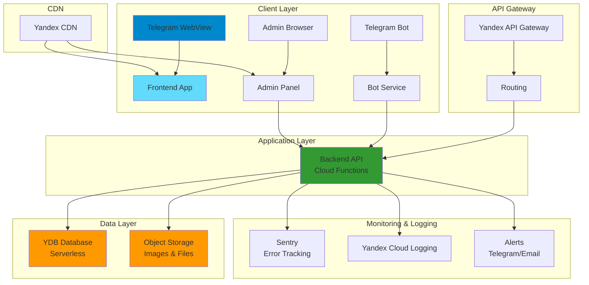

## Компоненты системы

### 1. Frontend (Telegram Web App)

**Технологии:**
- React 18 + TypeScript
- Vite для сборки
- React Router для роутинга
- TanStack Query для кеширования

**Архитектура:**

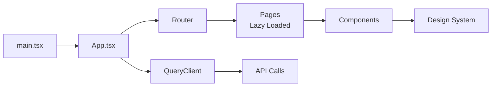

**Особенности:**
- Code splitting через React.lazy()
- Оптимизированные изображения с lazy loading
- Кеширование через React Query (5 минут)
- Preload критических ресурсов

### 2. Backend API

**Технологии:**
- Node.js + Express + TypeScript
- Yandex Cloud Functions (serverless)
- Sharp для оптимизации изображений

**Архитектура:**

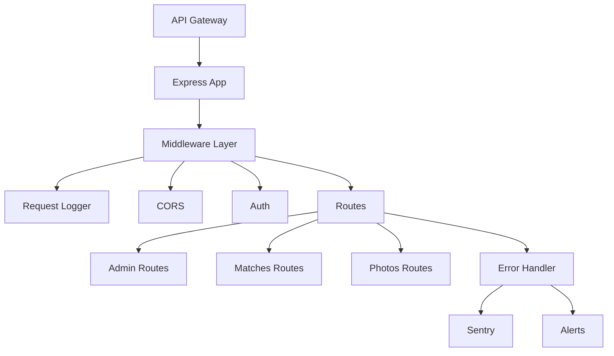

**Middleware Pipeline:**

1. **Request Logger** - логирование всех запросов
2. **CORS** - настройка CORS для админки
3. **Authentication** - проверка Telegram initData
4. **Routes** - обработка запросов
5. **Error Handler** - обработка ошибок

### 3. Database (YDB)

**Архитектура:**

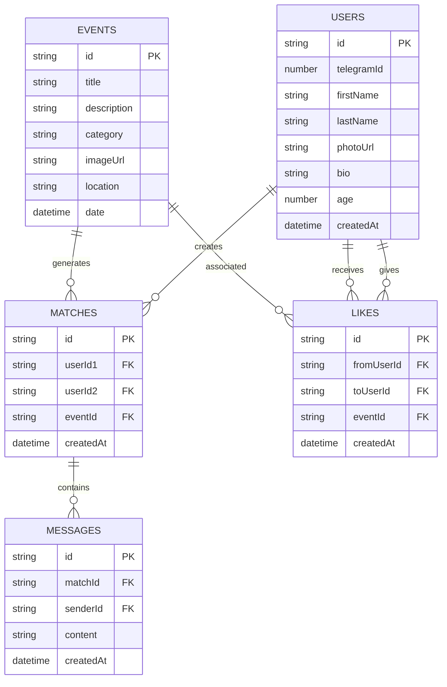

### 4. Object Storage

**Структура:**

```
bucket/
├── photos/
│   ├── {userId}/
│   │   ├── thumbnail.webp
│   │   ├── thumbnail.jpg
│   │   ├── medium.webp
│   │   ├── medium.jpg
│   │   ├── full.webp
│   │   └── full.jpg
│   └── ...
└── events/
    └── {eventId}/
        └── ...
```

**Оптимизация:**
- Автоматическое создание 3 размеров (thumbnail, medium, full)
- WebP формат (основной) + JPEG (фоллбэк)
- Blur placeholder для быстрой загрузки

### 5. Bot Service

**Архитектура:**

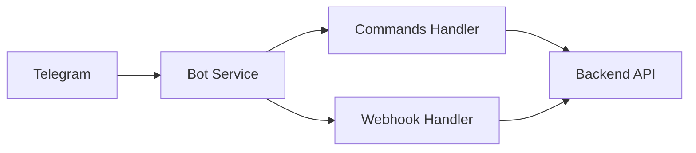

**Функции:**
- Обработка команд (`/start`, `/help`)
- Уведомления о матчах
- Интеграция с Web App

### 6. Admin Panel

**Архитектура:**

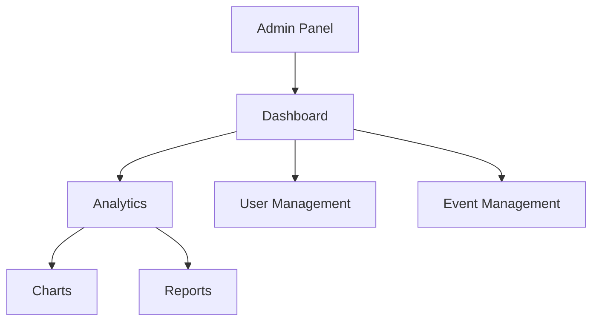

**Функции:**
- Аналитика пользователей
- Управление событиями
- Экспорт данных
- Мониторинг системы

## Потоки данных

### Создание матча

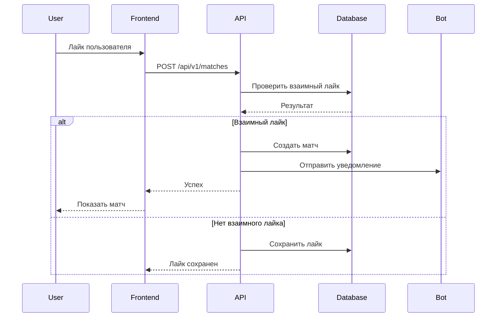

### Загрузка фото

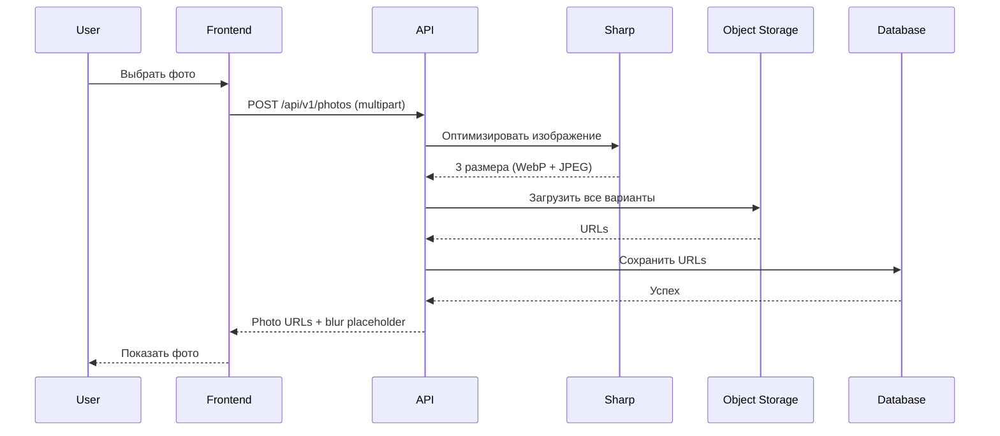

## Безопасность

### Аутентификация

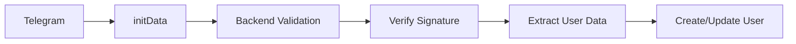

**Процесс:**
1. Telegram отправляет `initData` в Web App
2. Frontend передает `initData` в API
3. Backend проверяет подпись через Telegram Bot API
4. Извлекает данные пользователя
5. Создает или обновляет пользователя в БД

### Валидация данных

- Все входные данные валидируются через Zod
- Sanitize пользовательского контента
- Rate limiting на все endpoints
- Проверка размера файлов

## Масштабирование

### Горизонтальное масштабирование

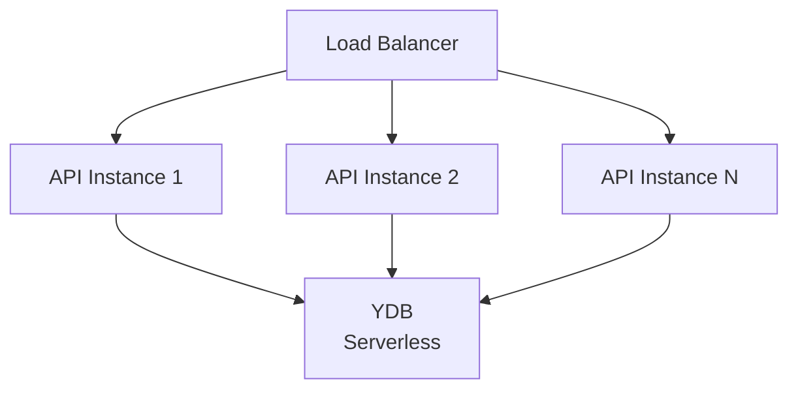

**Особенности:**
- YDB Serverless автоматически масштабируется
- Cloud Functions масштабируются автоматически
- Object Storage неограничен

### Кеширование

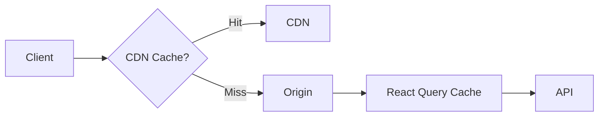

**Уровни кеширования:**
1. **CDN** - статические файлы (1 год)
2. **React Query** - API данные (5 минут)
3. **Browser Cache** - изображения и ресурсы

## Мониторинг

### Логирование

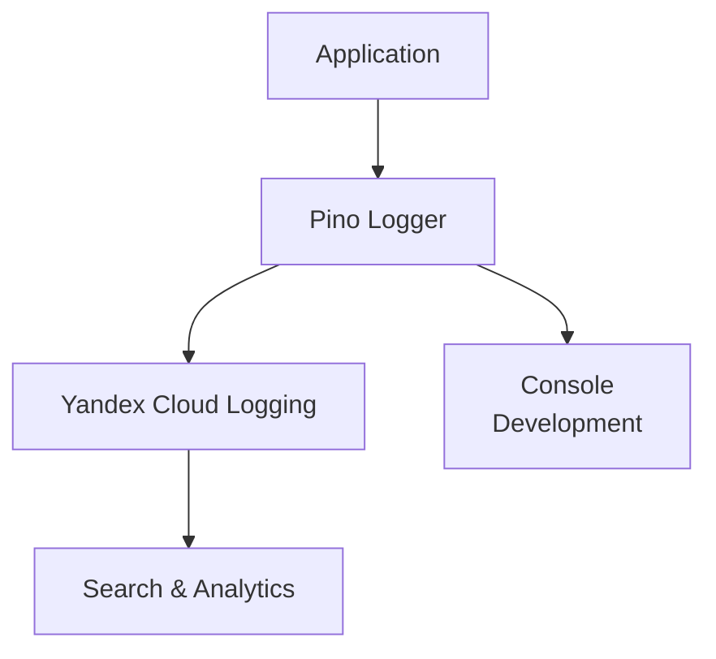

**Типы логов:**
- HTTP запросы (все)
- Создание матчей
- Ошибки загрузки фото
- Критические ошибки

### Error Tracking

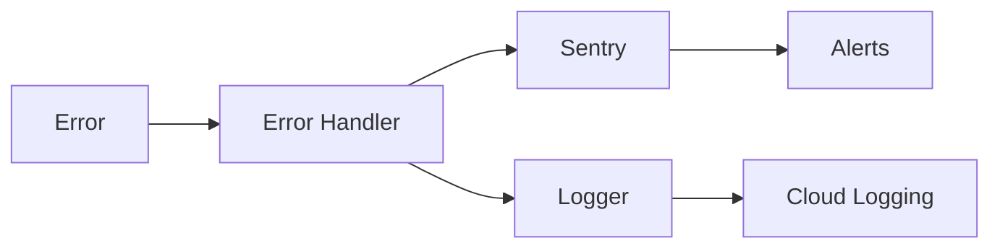

**Алерты:**
- Telegram уведомления
- Email уведомления

## Деплой

### CI/CD Pipeline

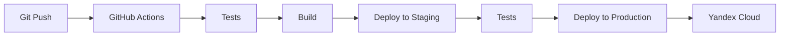

**Этапы:**
1. **Tests** - запуск тестов
2. **Build** - сборка всех сервисов
3. **Deploy Staging** - деплой в staging
4. **Integration Tests** - тесты на staging
5. **Deploy Production** - деплой в production

## Best Practices

1. **Separation of Concerns** - каждый сервис независим
2. **Type Safety** - TypeScript везде
3. **Error Handling** - централизованная обработка ошибок
4. **Logging** - структурированное логирование
5. **Monitoring** - мониторинг всех компонентов
6. **Security** - валидация и sanitize всех данных
7. **Performance** - оптимизация на всех уровнях

